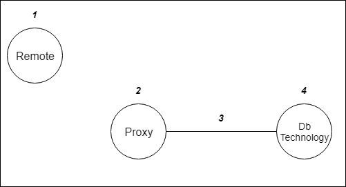

# Minimal (Hopefully) Working Examples of database technologies

The idea of this folder is to create a bundle of standalone examples where a charm (proxy) requests a database to the database technology charm and a remote charm is also able to connect to the database. The ultimate goal is for the generic database (see one level up) to have a relation between the proxy charm and the remote charm. That relation will share the details. This is not the goal of all folders here!

See the following image of what we want to achieve.



1. Is the remote charm. This charm is for all database technologies the same and can be found in the remote folder. It uses the apache-php layer and installs adminer.php. From this charm (host), we want to create a direct connection whatever database we want to use/created.
2. This is the proxy charm (the precursor of the generic database charm). In this charm the request for a database is given, if needed third party libraries are used. This also uses apache-php, adminer to render the details received over the interface layer (3). This is for testing and debugging purposes.
3. This is the interface layer of the database technology we want to use mysql, mysql-root, mysql-shared for mysql or pgsql for postgres.
4. This is the actual charm from the charm store for a database technology.


## The following examples (more or less) work:

- Postgresql via pgbouncer
- Mongo (only host + port) but adminer can correctly connect from remote
- Mysql shared part ok, mysql-root part NOT
- Redis NOT


## Notes:

- In all examples we use flags to render the the config file only once. If the connection details change afterwards it wont be re-rendered. A way to solve this (instead of the flags) is:

```python
if not data_changed('connection', connection):
    return
```

## Issues:

### Redis

Fails at

```
redis_db = redis_ep.redis_data()[0]
KeyError: 0
```

### Mariadb/mysql

Weird stuff
mysql-shared part is ok
mysql-root configured flag gets set in joined hook but file does not get rendered :/

